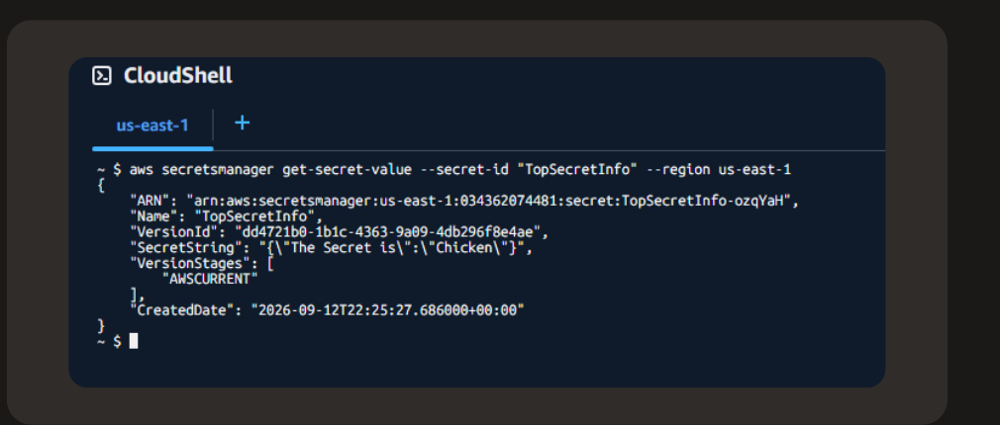
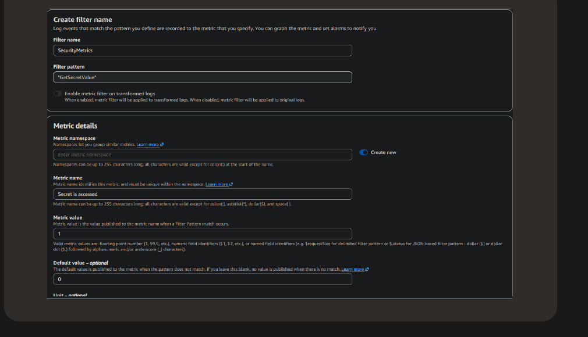
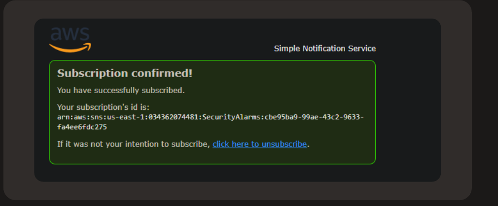
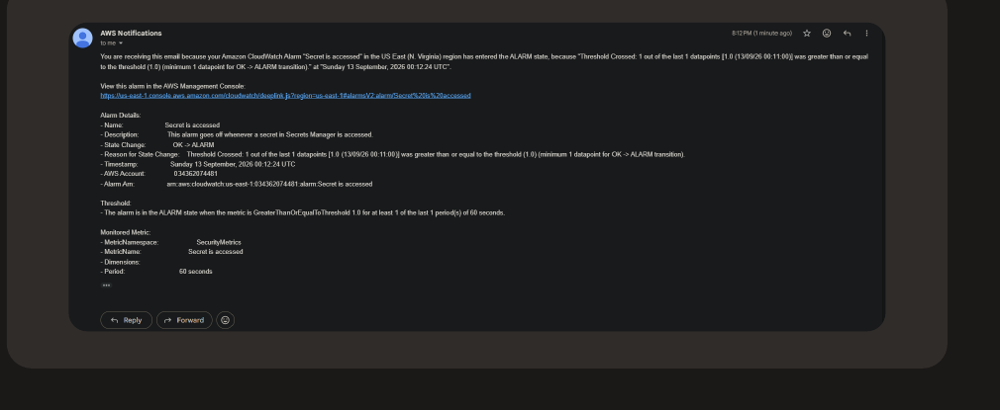
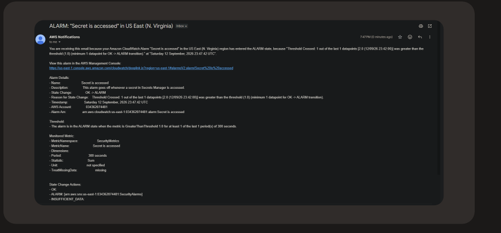

# Alert on Secret Access with CloudWatch and SNS

A hands-on AWS project wiring CloudTrail, a CloudWatch metric filter, and an SNS topic together so opening a secret triggers a real alert, not just a log line.

## The scenario

Secrets Manager keeps a credential safe from anyone who shouldn't have it. It doesn't tell you when someone who does have access actually opens it. This project builds a small pipeline on top of the [Secrets Manager project](../aws-secrets-manager-credentials): CloudTrail records the API call, a CloudWatch metric filter watches for it, and an alarm pushes an SNS notification the moment it happens.

The plumbing took longer than the console clicking. Getting CloudTrail, a metric filter, and an alarm to agree on the same event took more iteration than any single step on its own.

## Tools and concepts

- AWS CloudTrail (management events, Event history)
- Amazon CloudWatch Logs (metric filters, alarms, statistics and periods)
- Amazon SNS (topics, subscriptions, confirmation)
- AWS Secrets Manager (the `GetSecretValue` event this whole pipeline watches for)

## Steps

### 1. CloudTrail already had it covered

Secrets Manager API calls are logged as CloudTrail management events by default, so `GetSecretValue` shows up in Event history without any extra trail configuration. Read events like `GetSecretValue` and `DescribeSecret` report on state and change nothing; write events like `PutSecretValue`, `RotateSecret`, and `DeleteSecret` do. For this alarm, only one read mattered: the moment someone actually retrieves the secret's value.

### 2. Confirm the event shows up

Retrieved the secret two ways: once through the console's Retrieve secret value button, once from CloudShell with `aws secretsmanager get-secret-value`. Both showed up in CloudTrail as `GetSecretValue` events from `secretsmanager.amazonaws.com`, regardless of which interface made the call.

### 3. Turn the event into a metric

CloudTrail's Event history is fine for looking something up after the fact, but it isn't built to alert. A CloudWatch Logs metric filter is: point one at the log group CloudTrail writes to, and every matching event becomes a data point. Filtered on `"GetSecretValue"`, publishing to a metric called `Secret is accessed` under a new namespace, `SecurityMetrics`. Each match publishes a value of 1; a default value of 0 keeps the metric populated even when nothing matches, so the alarm always has data to evaluate.

### 4. Set the alarm

The alarm watches `Secret is accessed` and fires when the value is at or above 1 for at least one datapoint in a 60 second period. Any access at all should count, so the bar is deliberately low. Its only action is publishing to an SNS topic called `SecurityAlarms`.

### 5. Connect it to SNS

SNS topics don't deliver anything until a subscription confirms it wants the messages. Subscribed my email address and had to click a confirmation link before the topic would send anything my way. That confirmation step exists so nobody can subscribe an inbox they don't control to your alerts.

### Troubleshooting the first test

My first test access didn't produce an email. The cause was simple: I'd triggered `GetSecretValue` before confirming the SNS subscription, and an unconfirmed subscription receives nothing, alarm or not. Once confirmed, the next access came through within a minute: state change to ALARM, threshold crossed, exactly the config I'd set.

### Success

To validate it end to end, accessed the secret again and watched CloudWatch flip from OK to ALARM. SNS delivered the email seconds later: threshold crossed, one datapoint at or above 1, over a 60 second period.

### Extension: comparing notification sources

CloudTrail can send its own SNS notifications, but they fire when a trail delivers a new log file, not when a specific event happens, that tells you the pipe is flowing, not what came through it. Also retuned the CloudWatch alarm itself: moved from `GreaterThanOrEqualToThreshold` on a single 60 second datapoint to `GreaterThanThreshold` with a `Sum` statistic over 300 seconds, and set `TreatMissingData` to `missing` so a quiet period doesn't get read as a false OK. The alarm still does the part that matters: it's tied to the action, not to the log delivery mechanism underneath it.

## The part that mattered

CloudTrail alone would have told me a secret was accessed, if I went looking for it. The metric filter and alarm meant I didn't have to go looking, the alert came to me within a minute of the access happening. Small addition on top of the Secrets Manager project, but it's the difference between an audit trail and actual detection.
