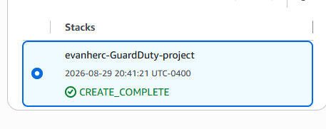
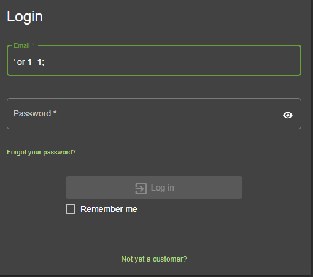
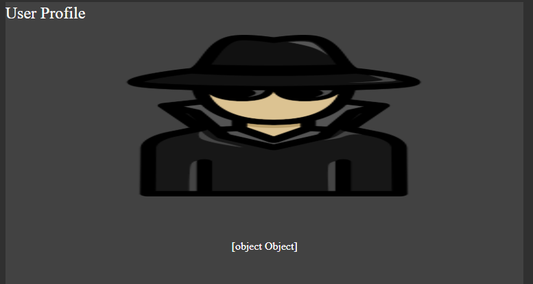
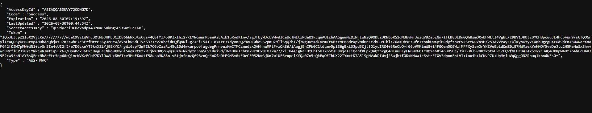
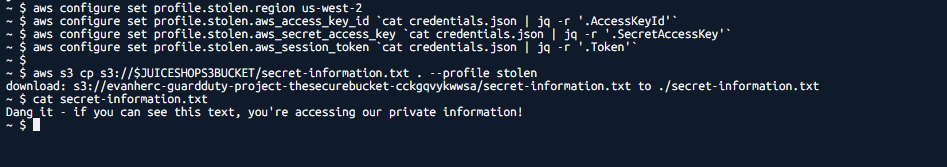
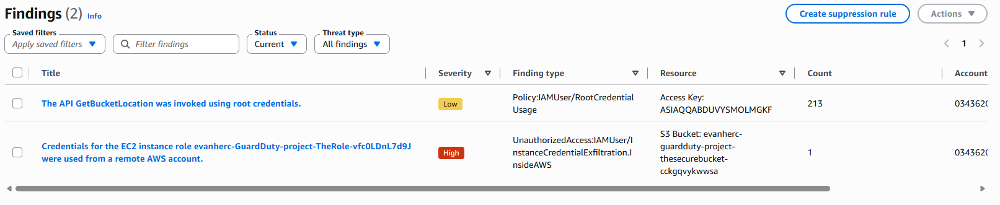
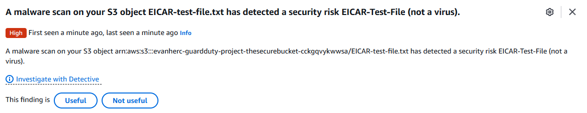

# Attacking and detecting with GuardDuty

A hands-on project attacking a deliberately vulnerable web app, stealing its AWS credentials, then switching to the defender's side to check whether GuardDuty actually caught it.

## Scenario

GuardDuty is a threat detection service that watches an AWS account for signs of compromise. Most of the time it's only seen from the defender's side, reading alerts after the fact. This project plays both roles: attack a vulnerable app first, then check whether detection actually noticed.

The target was Juice Shop, an intentionally vulnerable web app, deployed through a CloudFormation template with CloudFront, a VPC, and EC2 behind it.

## Tools and concepts

- S3, GuardDuty, CloudFormation, CloudShell
- SQL injection, command injection, credential theft, malware detection

## Step 1: deploy the target

Juice Shop was deployed through a CloudFormation stack rather than set up by hand, so the vulnerable app, its networking, and its (deliberately exposed) IAM role all came up together in one shot.

## Step 2: try SQL injection on the login form

SQL injection means feeding the login form a string that changes the meaning of the underlying query instead of just supplying a value. A classic version, entering something that always evaluates true, can bypass a login check entirely if the query isn't built safely.

## Step 3: command injection exposes credentials

Juice Shop's deployment leaves IAM credentials sitting in a publicly reachable JSON file. Command injection, getting the server to run an unintended command through a field that wasn't sanitized, is what actually reaches that file and pulls its contents.

These are temporary, role-scoped credentials tied to the demo stack, not long-term account keys, and expire on their own a short time after being issued.

## Step 4: use the stolen credentials

From CloudShell, the stolen credentials were loaded into a separate AWS CLI profile, kept apart from any real credentials on the machine, then used to pull a file directly out of the app's S3 bucket.

## Step 5: check whether GuardDuty caught it

GuardDuty reported two findings:

- **Low severity:** the `GetBucketLocation` API called with root credentials, unusual, but not inherently malicious on its own
- **High severity:** the EC2 instance role's credentials used from a remote AWS account entirely outside this one, exactly what happened once the stolen keys were configured into a separate CLI profile and used

## Extra: testing malware protection

GuardDuty's S3 malware protection was enabled as an extension to the project. Uploading the EICAR test file, a harmless string every antivirus vendor agrees to flag as if it were malware, without containing any actual malicious code, confirmed the scanner was watching the bucket.

## The decision that mattered

Attacking the app was the easy half. Credentials sitting in a public JSON file, and a command injection path reachable from a normal input field, did most of the work. The more useful half was confirming what actually shows up on the other side: GuardDuty didn't just flag "something happened," it distinguished an unusual but explainable action (root credentials calling an API) from a genuine compromise signature (instance credentials being used somewhere they never should be).

That distinction, low severity versus high, unusual versus confirmed exfiltration, is the actual point of running detection tooling instead of just logging everything and hoping someone reads it.
