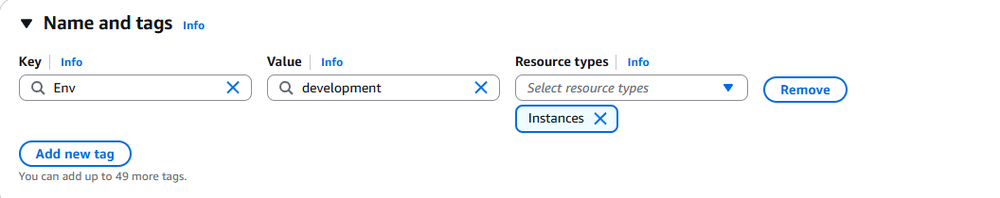
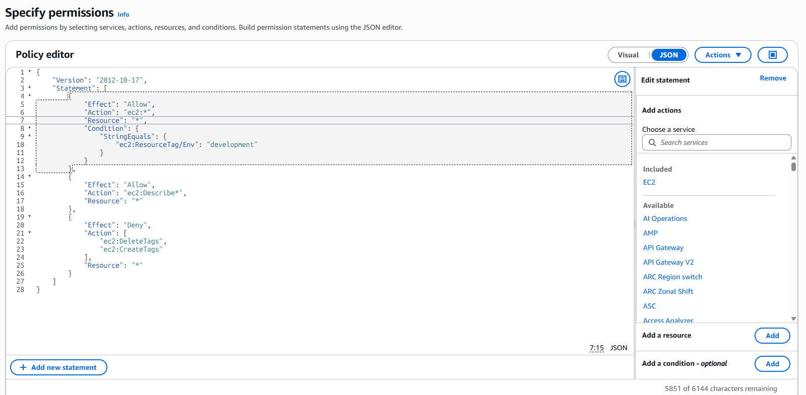
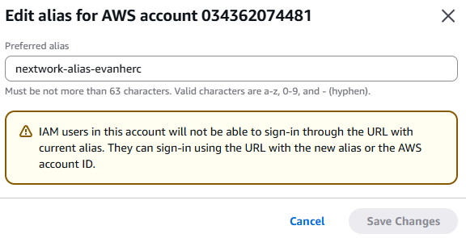
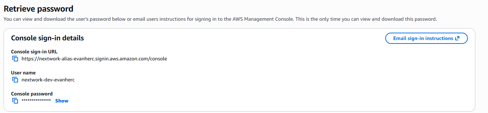
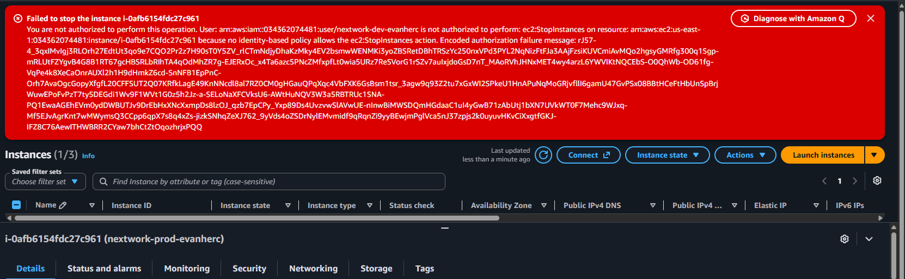
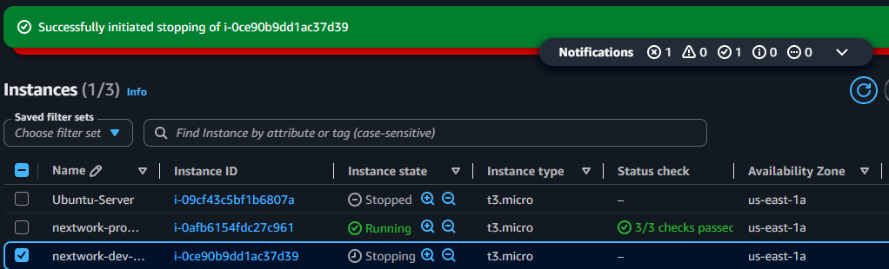

# Scoping intern access with AWS IAM

A hands-on project scoping EC2 access for a new intern, using resource tags, a custom IAM policy, an account alias, and a dedicated IAM group and user.

## Scenario

A new intern needs access to AWS, but only to one EC2 instance: the development one. Production stays off limits.

This project builds that access model from scratch: tag the instances by environment, write a policy that reads the tag, wrap it in a group and user the intern can actually sign in with, then test both the allow and the deny path.

## Tools and concepts

- EC2: two instances, tagged by environment
- IAM: policies, groups, users, account alias, policy simulator

## Step 1: tag the instances by environment

Tags are how AWS tells resources apart when a policy needs to treat them differently. Each EC2 instance got a tag key called `Env`, set to either `production` or `development`. That tag is what the policy checks before it allows any action.



## Step 2: write the IAM policy

A policy statement has three parts: effect (allow or deny), action (what it applies to), and resource (which resources it covers). This policy has three statements:

- Allow all EC2 actions, but only on instances tagged `Env=development`
- Allow `ec2:Describe*` everywhere, so the user can see what exists
- Deny `ec2:CreateTags` and `ec2:DeleteTags` everywhere, so nobody can retag an instance to get around the first rule

```json
{
  "Version": "2012-10-17",
  "Statement": [
    {
      "Effect": "Allow",
      "Action": "ec2:*",
      "Resource": "*",
      "Condition": {
        "StringEquals": {
          "ec2:ResourceTag/Env": "development"
        }
      }
    },
    {
      "Effect": "Allow",
      "Action": "ec2:Describe*",
      "Resource": "*"
    },
    {
      "Effect": "Deny",
      "Action": [
        "ec2:DeleteTags",
        "ec2:CreateTags"
      ],
      "Resource": "*"
    }
  ]
}
```



## Step 3: set up an account alias

By default, IAM users sign in through a URL built from the twelve digit account ID. An alias replaces that with a name. This account uses `nextwork-alias-evanherc`, so the intern signs in through a normal looking URL instead of an account number.



## Step 4: create the group and the user

The policy is attached to an IAM group, not to the user directly. Anyone added to the group later inherits the same restrictions automatically. The IAM user was created inside that group, and its sign-in details were generated from there.



## Step 5: test what should fail

Signed in as the intern user and tried to stop the production instance. AWS denied it and named the exact policy statement that blocked the action, confirming the tag condition was working.



## Step 6: test what should work

Same user, same action, this time on the development instance. It stopped without any issues.



## The decision that mattered

The policy wouldn't have done anything useful without the tag condition. Without it, `ec2:*` would apply to every instance in the account, production included.

The deny rule on `CreateTags` and `DeleteTags` closes the obvious workaround: retag production as development, and the allow rule would apply to it too.

The policy was also run through IAM Policy Simulator afterward, to check permissions before touching anything live.
