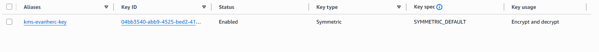
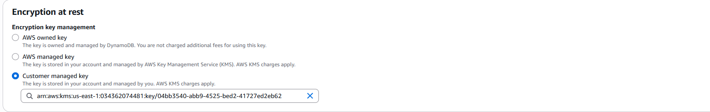
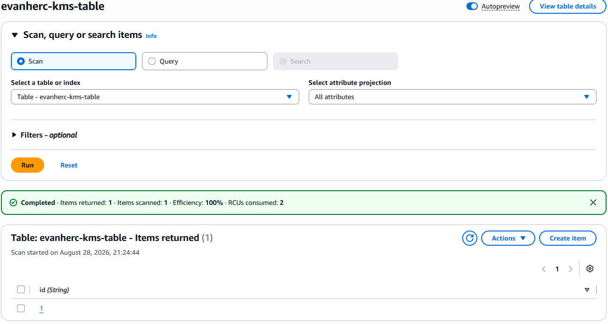
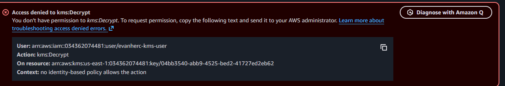
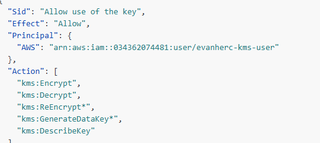

# Encrypting a DynamoDB table with AWS KMS

A hands-on project setting up a customer managed key, encrypting a DynamoDB table, and testing who can actually decrypt it.

## Scenario

KMS creates and controls the encryption keys used to protect data across AWS. This project used it to encrypt a DynamoDB table, then checked whether encryption alone was enough to keep the data private, or whether a user still needed separate permission on the key itself.

## Tools and concepts

- KMS: symmetric keys, key policies
- IAM: a restricted test user
- DynamoDB: encryption at rest options

## Step 1: create a symmetric key

Encryption keys come in two types. A symmetric key uses one key for both encrypting and decrypting. An asymmetric key uses a public and private pair.

A symmetric key is what KMS uses by default for data at rest, and it's faster than asymmetric encryption for that kind of workload.

## Step 2: encrypt the DynamoDB table

DynamoDB offers three encryption options: AWS owned, AWS managed, and customer managed. The difference is who holds and controls the key. Customer managed keeps the key under this account rather than a default key owned by AWS or by DynamoDB.

## Step 3: check who can see the data

Encrypting the table didn't hide it from the account that created it. DynamoDB uses transparent encryption, meaning an account with access to the table can still read the items directly.

Encryption protects data in storage. It doesn't protect data from an account that already has both table and key permissions.

## Step 4: test with a restricted user

A second IAM user was created with full DynamoDB access, but no permission on the KMS key.

Signed in as that user and tried to read the table. AWS denied the read, since decrypting the data required `kms:Decrypt`, and no policy granted it.

## Step 5: grant access through the key policy

IAM permission on the table wasn't enough. The key has its own policy, separate from IAM, and that policy has to name the user too.

The test user was added to the key policy with encrypt, decrypt, and describe actions. Trying the read again worked.

## The decision that mattered

Table access and key access are two separate gates. Full permission on DynamoDB didn't matter until the key policy also allowed the same user.

That's the point of combining encryption with IAM: one misconfigured policy doesn't expose the data on its own, since a second, independent check still has to pass.
