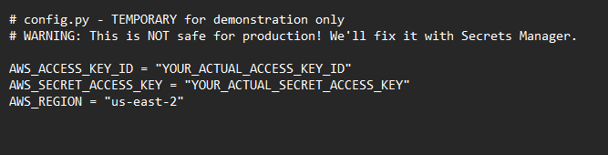
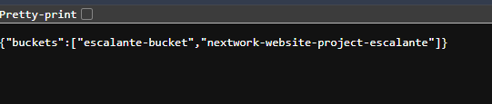
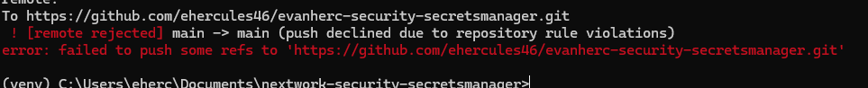
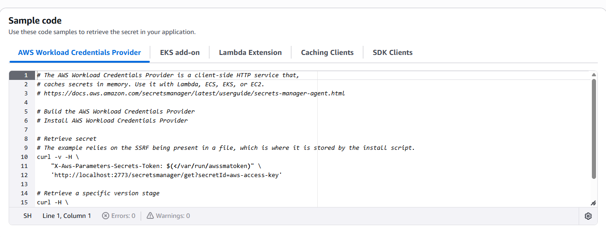
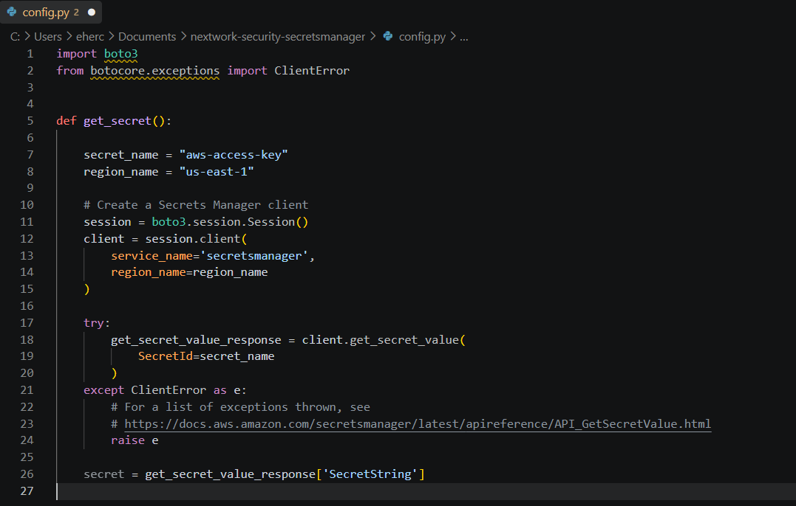
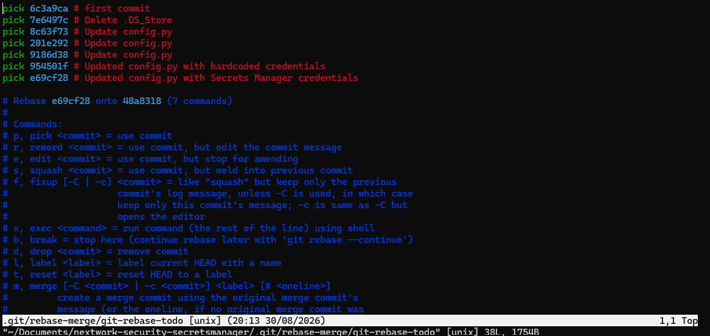

# Secure Secrets with AWS Secrets Manager

A hands-on AWS project replacing hardcoded credentials in a web app with AWS Secrets Manager, then cleaning them out of git history after GitHub blocked the push.

## The scenario

A sample FastAPI web app needed AWS credentials to list S3 buckets, and the fast way to get it running was to hardcode an access key and secret directly in config.py. Hardcoded keys are risky because that same file gets committed to git, forked, and shared, so anyone with access to the repository can read live credentials for databases, APIs, and other AWS services.

The fix in this project has two parts: move the credentials into Secrets Manager so the app fetches them at runtime instead of storing them in code, and clean the earlier hardcoded version back out of git history.

## Tools and concepts

- AWS Secrets Manager (storing and retrieving credentials, sample SDK code)
- Python, boto3, FastAPI, uvicorn
- Git and GitHub (forking, remotes, commits, push protection)
- Interactive rebase (`git rebase -i`) and merge conflict resolution

## Steps

### 1. Hardcode credentials (on purpose)

Started with a `config.py` file that hardcodes `AWS_ACCESS_KEY_ID`, `AWS_SECRET_ACCESS_KEY`, and `AWS_REGION` directly in the code, the exact pattern Secrets Manager exists to fix.

### 2. Run the app locally

Set up a virtual environment and installed boto3, fastapi, and uvicorn, then launched the app. Placeholder credentials in config.py caused an `InvalidAccessKeyId` error; swapping in real AWS credentials let the app authenticate and list S3 buckets successfully.

### 3. GitHub blocks the push

Forked the project repository, connected the local repo to it as a remote, and ran `git add`, `git commit`, and `git push`. GitHub rejected the push with a repository rule violation, its push protection detected the AWS credentials in the commit and blocked it before they reached the remote repository.

### 4. Store the secret properly

AWS Secrets Manager stores the credentials as a single secret, so the app can request them by name at runtime instead of holding them directly. It can also rotate credentials automatically on a schedule, and the console provides sample retrieval code across several patterns (AWS SDK, Lambda extensions, caching clients).

### 5. Fetch the secret at runtime

Rewrote `config.py`'s `get_secret()` function to call Secrets Manager's `get_secret_value()` instead of returning hardcoded strings. The function extracts `AWS_ACCESS_KEY_ID`, `AWS_SECRET_ACCESS_KEY`, and `AWS_REGION` from the returned secret, falling back to the boto3 session's region if `AWS_REGION` isn't present.

### 6. Clean the git history

Updating `config.py` going forward wasn't enough since the hardcoded credentials were still sitting in an earlier commit (`954501f`, "Updated config.py with hardcoded credentials"). Used an interactive rebase (`git rebase -i`) and marked that commit as `drop`, removing it from history entirely. Dropping it caused a conflict when git tried to replay the next commit on top, since that commit's changes assumed the dropped one was still there; resolved it by keeping the Secrets Manager version of config.py and continuing the rebase.

## The decision that mattered

Fixing the code was the easy part. The credentials were already in git history the moment they were committed, so updating config.py alone was never going to be enough, the commit that introduced them had to be dropped. Combining Secrets Manager with a rebase addressed both halves of the problem: where the app gets its credentials from now, and making sure the old ones weren't still sitting in a past commit. GitHub's push protection was a good reminder that this mistake is common enough that platforms actively watch for it, but it doesn't replace catching it yourself before you commit.
