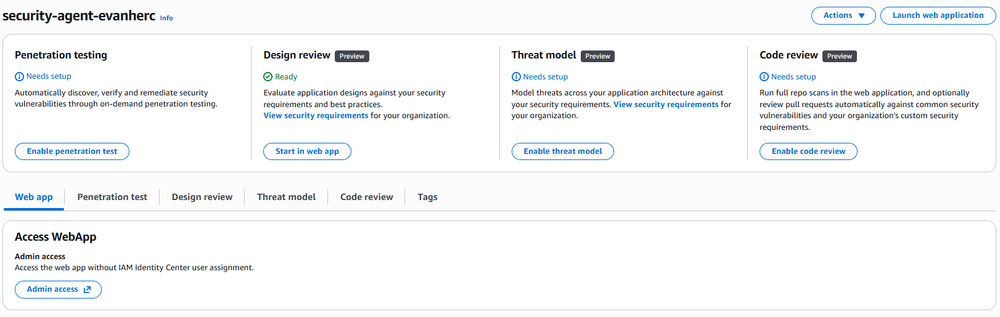
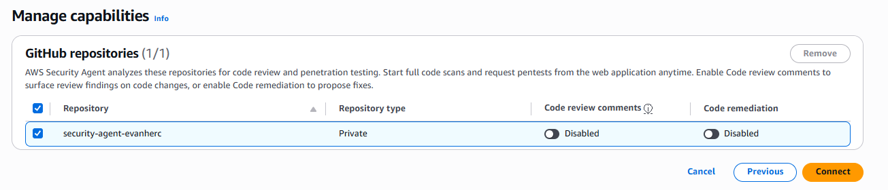
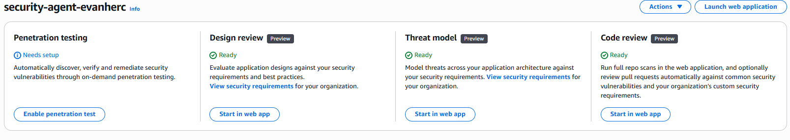
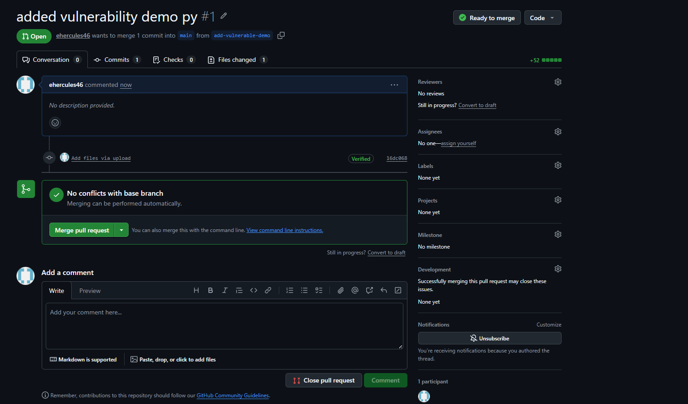
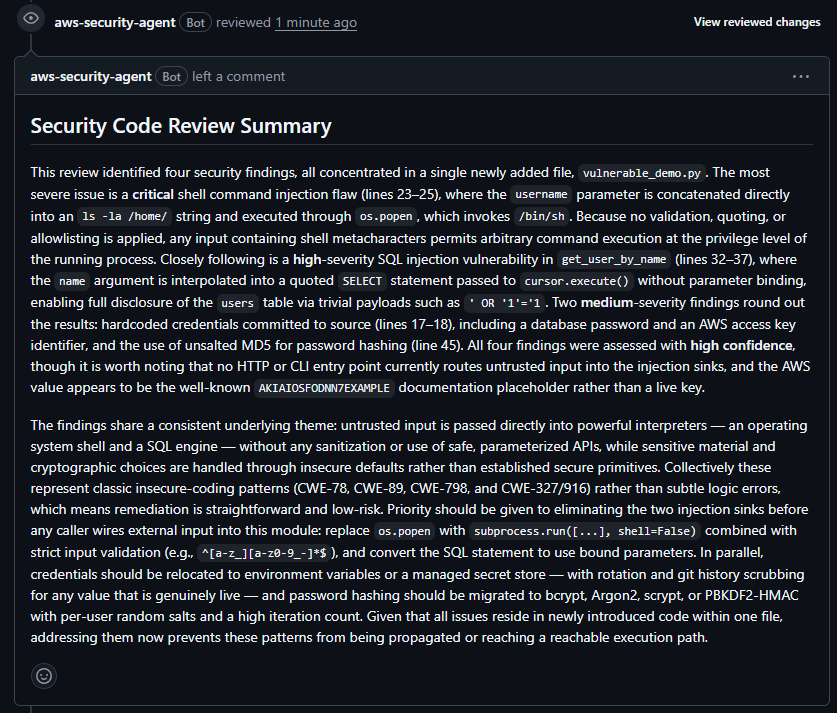
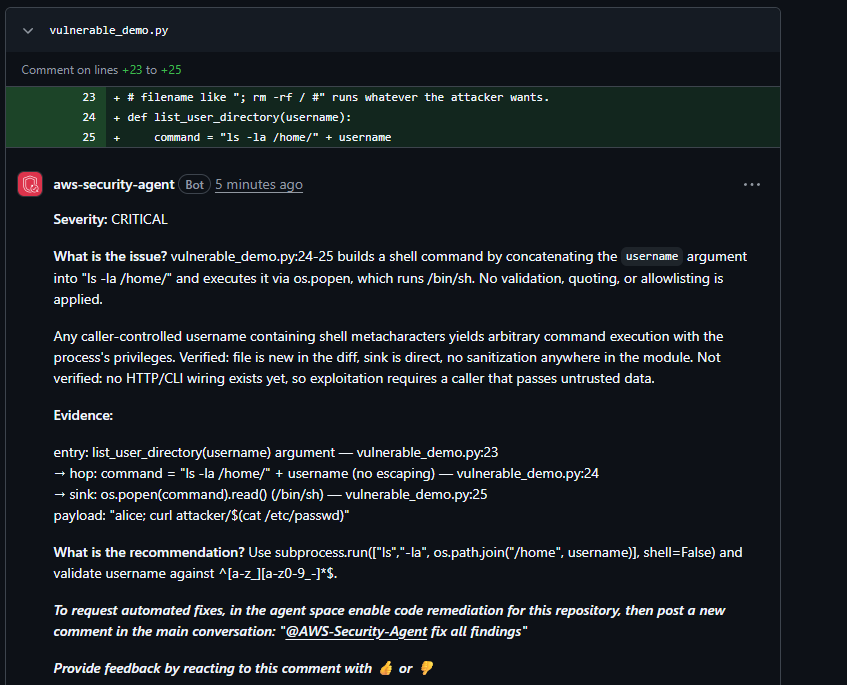

# Testing AWS Security Agent's code review

A hands-on test of AWS Security Agent, connecting it to a GitHub repo and watching it review a pull request full of intentionally vulnerable code.

## Scenario

AWS Security Agent does three things: architecture design reviews, code review in pull requests, and on-demand penetration testing. Design review, threat modeling, and code review are all still in public preview and free to use. Penetration testing went generally available separately and costs $50 per task-hour, that's a different project for later, since it needs domain verification and more setup.

This project tests the code review capability only: connect a GitHub repo, push a file with known vulnerabilities, open a pull request, and see what the agent catches.

## Tools and concepts

- AWS Security Agent: Agent Space, GitHub integration, code review
- GitHub: a private test repo, kept separate from other projects so vulnerable demo code never sits near real work

## Step 1: create an Agent Space

An Agent Space is a scoped environment for a project or org unit. Created one, gave it a name, and left the default access settings, capabilities like code review and penetration testing get configured after the space exists, not during creation.

## Step 2: connect GitHub and scope it to one repo

Code review needs a GitHub connection. This uses a GitHub App model: install the app, authorize it, then choose which repositories it can see.

A private, single-purpose repo was used for this, not a real project repo, since it's the only clean way to keep intentionally vulnerable test code out of an actual codebase. Access was scoped to just that one repository rather than "all repositories."

## Step 3: enable code review comments

The connection alone doesn't do anything. Code review comments has its own toggle, separate from just connecting the repo, and needs to be turned on before the agent will actually post findings on pull requests.

## Step 4: push vulnerable code and open a pull request

Wrote a small Python file with four deliberate issues: a hardcoded AWS access key and database password, a shell command built by concatenating user input, a SQL query built the same way, and password hashing with MD5. Pushed it to a branch and opened a pull request against main, without merging it.

## Step 5: read the findings

The agent picked up the PR on its own and posted two kinds of feedback: a summary comment covering all four issues, and inline comments anchored to the specific lines that triggered each one.

The summary comment identified all four issues, ranked by severity, each tied to a CWE number, with a combined remediation plan. It also noted that the hardcoded AWS key was AWS's own well-known placeholder value rather than a live credential, which shows some contextual reasoning rather than plain pattern matching.

The inline comment on the shell injection issue went further: it traced the full path from the function argument through the unescaped string concatenation to the `os.popen` call, gave a working example exploit payload, and separated what it could verify (the code path is exploitable as written) from what it couldn't (whether anything currently calls this function with untrusted input).

## The timeline

| Time | Event |
|---|---|
| 4:38 PM | Agent Space created |
| 4:45 PM | Code review enabled and marked Ready |
| 4:48 PM | Pull request opened |
| 4:49 PM | Agent acknowledges the PR |
| 4:54 PM | Full summary comment posted |
| 4:59 PM | Inline line-level comment posted |

Setup to first working test: about 21 minutes. From opening the pull request to the last comment landing: under 11 minutes.

## What this actually costs

Code review, design review, and threat modeling are unbilled during preview. This entire test, Agent Space, GitHub connection, and every comment the agent posted, cost $0. The only part of AWS Security Agent that costs money is penetration testing, at $50 per task-hour, which wasn't touched here.

## The decision that mattered

The vulnerable code went on a private repo, on its own branch, scoped so the GitHub App could only see that one repository. The pull request was closed without merging once testing was done, so the vulnerable code never touched `main` and the GitHub App never had broader access than it needed. Testing a security tool is still worth treating like handling something sensitive, since the whole point of the exercise is code you'd never want live.
