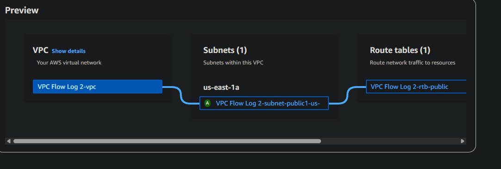
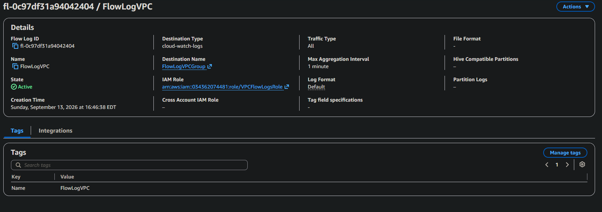
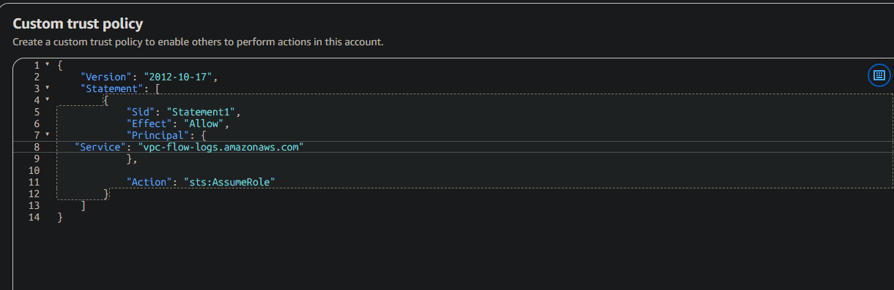
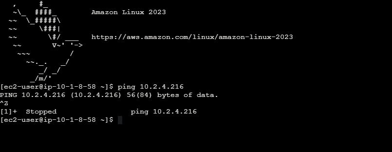
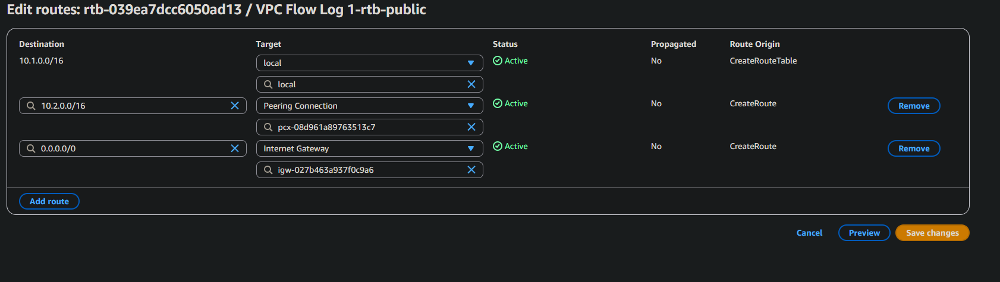
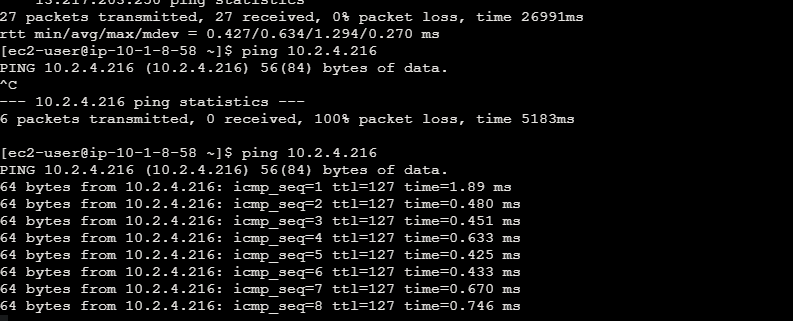
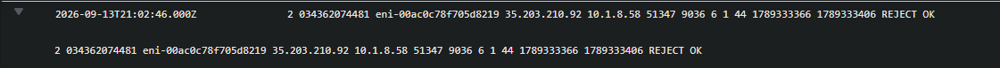
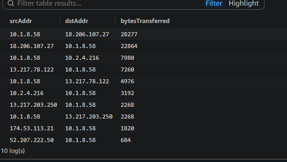

# VPC Monitoring with Flow Logs

A hands-on AWS project building a two-VPC architecture, peering them together to fix a routing gap, and using VPC Flow Logs and CloudWatch Logs Insights to see exactly what crossed the wire.

## The scenario

I built two separate VPCs, each with its own public subnet and EC2 instance, then turned on VPC Flow Logs to see what was actually happening at the network layer, not just what the console said was configured. The project split naturally into two halves: build the network first, then test it and watch the logs to confirm it behaved the way I expected.

## Tools and concepts

- Amazon VPC (multi-VPC architecture, CIDR planning, VPC peering)
- Amazon EC2 (instances used to generate real traffic between VPCs)
- VPC Flow Logs (traffic metadata, ACCEPT/REJECT records)
- Amazon CloudWatch Logs and Logs Insights (log delivery, querying flow log data)
- IAM (a custom trust policy scoped to the Flow Logs service)

## Steps

### 1. A two-VPC architecture

VPC 1 and VPC 2 each got their own CIDR block, `10.1.0.0/16` and `10.2.0.0/16`, plus a public subnet and route table. CIDR blocks have to be unique across any VPCs you plan to connect later, overlapping ranges can't be routed between each other, so picking non-overlapping blocks up front mattered more than it looked like at the time. Each VPC got one EC2 instance in its public subnet, which is what the rest of the project tests traffic between.

### 2. Turning on Flow Logs

A VPC Flow Log records metadata about the traffic hitting network interfaces in the VPC: source and destination, ports, protocol, byte counts, and whether it was accepted or rejected. This one publishes to CloudWatch Logs, capturing all traffic types with a one minute aggregation interval, delivered through a dedicated IAM role rather than the console's default handling.

### 3. A trust policy just for Flow Logs

The IAM role Flow Logs assumes needs a trust policy naming `vpc-flow-logs.amazonaws.com` as the principal allowed to call `sts:AssumeRole`, that's what's different from a typical EC2 or Lambda execution role. Without that specific trust relationship, the flow log has nowhere to deliver its records even if the destination and permissions are otherwise correct.

### 4. The ping that didn't work

With both instances up, I tried pinging Instance 2's private IP address from Instance 1. Nothing came back, the request just hung. Pinging Instance 2's public IP address instead worked fine, which narrowed the problem down immediately: this wasn't a security group or OS-level block, it was a missing path between the two private networks.

### 5. Fixing it with VPC peering

Checking VPC 1's route table confirmed it: there was a local route for its own CIDR and a route to the internet gateway, but nothing pointing at VPC 2's address range at all. I created a peering connection between the two VPCs, then added a route in each route table sending the other VPC's CIDR through the peering connection instead of leaving it unrouted.

### 6. Confirming the fix

Same ping, same private IP address, run again after the peering routes were in place. This time every packet got a reply. Going from 100% packet loss to a clean run of replies on the exact same command was the clearest signal that the routing gap, not anything else, had been the problem all along.

### 7. What a flow log record actually says

Each flow log line is a fixed set of fields: version, account ID, interface ID, source and destination address and port, protocol, packet and byte counts, a time window, and an action, `ACCEPT` or `REJECT`. This particular record shows an external address reaching out to a port on my instance and getting rejected, one packet, 44 bytes, logged and blocked without me ever touching the console. That's the part a route table or security group alone can't give you: not just what's allowed, but a record of what was attempted.

### 8. Logs Insights: finding the heaviest traffic

CloudWatch Logs Insights let me query the flow log data directly instead of reading raw lines, grouping by source and destination address to see total bytes transferred between each pair. The traffic between my two instances over the peering connection showed up clearly in the results, alongside smaller amounts to and from a handful of outside addresses, exactly the pattern I'd expect from a two-VPC test setup with peering in place.

## The decision that mattered

The route table and the peering connection decided whether traffic could move between the VPCs at all, that's what actually fixed the ping. Flow Logs didn't fix anything, they just told the truth about what was happening before and after. That's the real value of turning logging on before you need it: the rejected record and the Logs Insights query weren't there to solve the problem, they were there to prove the fix actually worked, and would keep proving it long after this project ended.
