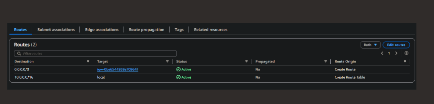
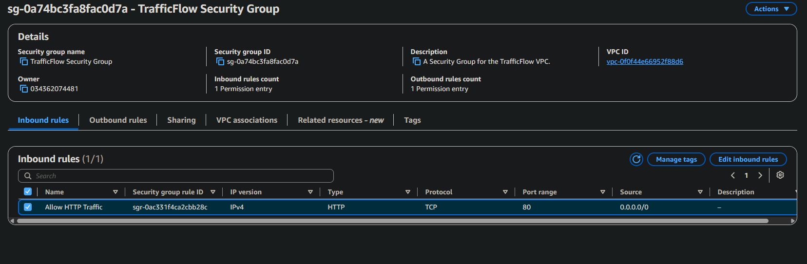
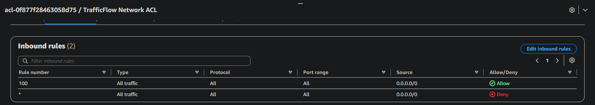
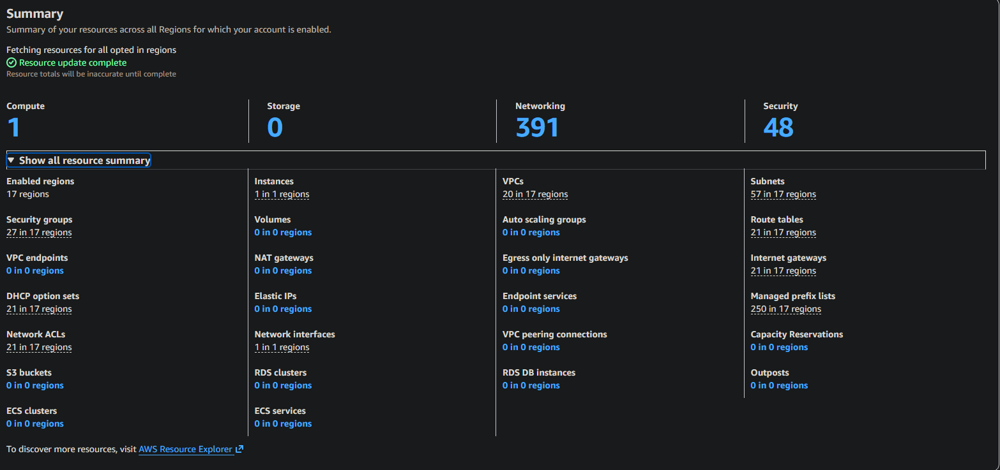

# VPC Traffic Flow and Security

A hands-on AWS project building a custom VPC, routing traffic through an internet gateway, and comparing security groups to network ACLs at the edge.

## The scenario

I built a custom VPC, TrafficFlow, with a public subnet meant to serve HTTP traffic and nothing else. The goal wasn't just to stand up the resources, it was to see exactly what makes a subnet public in the first place, and where a request actually gets stopped or let through on its way in. That meant walking through three separate layers: the route table, the security group, and the network ACL, each controlling a different part of the same path.

## Tools and concepts

- Amazon VPC (custom VPC, CIDR blocks, subnets)
- Route tables (destinations, targets, internet gateways)
- Security groups (stateful, instance-level, allow-only)
- Network ACLs (stateless, subnet-level, allow and deny)
- AWS Resource Explorer (global view across regions)

## Steps

### 1. Route tables decide where traffic can go

A route table only needs two things to make a subnet public: a local route for the VPC's own CIDR block, and a route sending everything else to an internet gateway. The TrafficFlow route table has exactly that: `10.0.0.0/16` targets `local` for traffic within the VPC, and `0.0.0.0/0` targets the internet gateway for everything else, both active. Without that second route, nothing else in this project would matter, traffic would have no path out regardless of what any security group allows.

### 2. Security groups: stateful, instance-level, allow-only

Security groups attach to instances and only support allow rules, anything not explicitly allowed is denied by default. The TrafficFlow Security Group has exactly one inbound rule: HTTP over TCP on port 80, open to `0.0.0.0/0`. By default its outbound rule allows all traffic out. Security groups are also stateful, so a response to an allowed inbound request is automatically permitted back out without needing a matching outbound rule.

### 3. Network ACLs: stateless, subnet-level, allow and deny

Network ACLs sit at the subnet level rather than the instance level, and unlike security groups they support explicit deny rules, evaluated in order by rule number. The TrafficFlow Network ACL shows the default pattern: rule 100 allows all traffic, and the final wildcard rule denies everything else, the same shape every new default network ACL starts with. A custom network ACL flips that default: instead of starting open and needing a deny added, it starts by denying all traffic until rules are added to open it back up. Being stateless also means NACLs don't remember connections the way security groups do, a response has to be explicitly allowed on the way back out, not just assumed.

### 4. Tracking resources across every region

With a few networking resources spread across regions, I used AWS Resource Explorer's global view to see everything in one place instead of switching regions one at a time. The summary counted 20 VPCs across 17 regions, 391 networking resources in total, and 48 security resources, security groups and network ACLs included, all opted-in regions accounted for in a single screen. That's the kind of check worth running after a project like this: confirming nothing got left behind in a region I wasn't actively looking at.

## The decision that mattered

Permission and path are two different questions, and this project only works because both were answered. The security group decides what's allowed in; the route table decides whether traffic can reach the subnet at all. A wide-open security group rule does nothing without a route to the internet gateway behind it, and a perfect route means nothing if the security group denies everything on arrival. The network ACL adds a second, independent checkpoint at the subnet boundary, stateless and rule-ordered, so a mistake in the security group isn't the only thing standing between the subnet and the internet.
