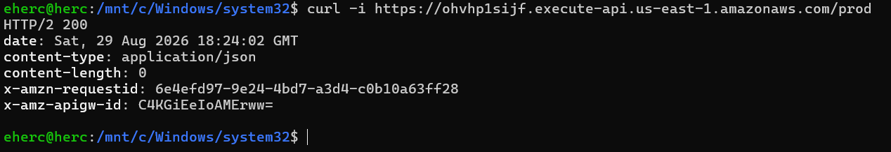
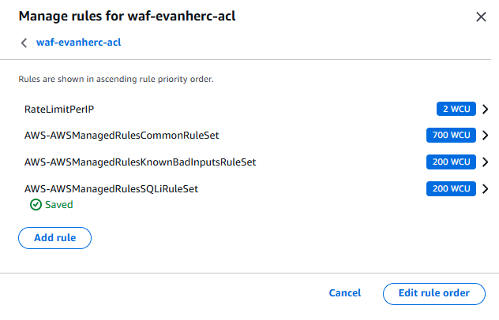
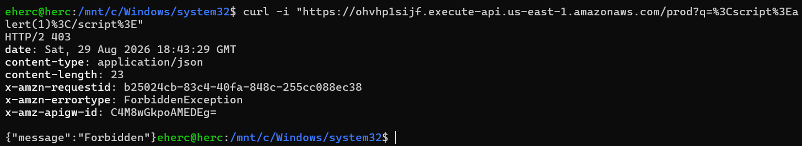
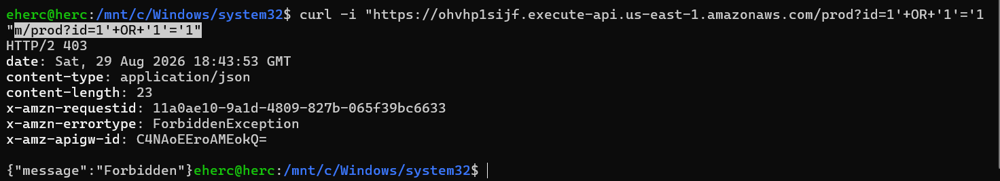
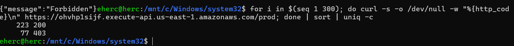
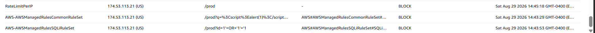

# Blocking web attacks with AWS WAF

A hands-on project building a web ACL, attaching it to a live endpoint, and watching it block a cross-site scripting attempt, a SQL injection attempt, and a request flood.

## Scenario

A web application firewall sits in front of an app and checks every HTTP request before it reaches the code. Anything that looks like SQL injection, cross-site scripting, or a flood from one address gets stopped. Everything else carries on as normal.

This project builds one: create the firewall, load a rule set, point it at a live endpoint, then send real traffic at it and watch what gets through and what doesn't.

## Tools and concepts

- API Gateway: a mock REST API to act as the protected endpoint
- WAF: a web ACL, managed rule groups, a custom rate-based rule

## Step 1: give WAF something to protect

WAF needs a resource to attach to. An API Gateway REST API with a mock integration, a fake backend that returns a canned response, was deployed to a stage called `prod` and tested before adding any firewall at all.



## Step 2: build the rule set

A web ACL is a container of rules. Every request gets checked against them in order, and the first match decides the outcome: allow, block, or count.

The rule set has four parts:

- Core rule set, broad protection against common attack patterns
- Known bad inputs, blocks patterns tied to known exploits and scanners
- SQL database, blocks SQL injection patterns
- `RateLimitPerIP`, a custom rule blocking any address over 100 requests in five minutes

**A correction worth flagging:** SQL injection used to be covered inside the Core rule set. It isn't anymore. Without the separate SQL database rule group added here, the SQL injection test later in this project would have gone straight through.



## Step 3: send a cross-site scripting attempt

With the web ACL attached to the API stage, normal traffic still returned 200, unchanged, WAF is invisible to legitimate requests. A script tag through the query string, a textbook XSS pattern, is a different story.

```
curl -i "https://<invoke-url>/prod?q=%3Cscript%3Ealert(1)%3C/script%3E"
```



## Step 4: send a SQL injection attempt

This is the request that would have failed silently before the correction above. A classic SQL injection pattern in the query string, the same kind of payload that used to slip past the Core rule set alone.

```
curl -i "https://<invoke-url>/prod?id=1'+OR+'1'='1"
```

With the SQL database rule group in place, it got caught.



## Step 5: trip the rate limit

Firing 300 requests in a loop and counting the results by status code shows the rate rule kick in partway through: a run of allowed requests, then a run of blocks once the address crossed the limit inside the five minute window.

```
for i in $(seq 1 300); do curl -s -o /dev/null -w "%{http_code}\n" https://<invoke-url>/prod; done | sort | uniq -c
```



## Step 6: confirm which rule caught what

WAF's sampled requests view names the exact rule that terminated each blocked request. The XSS attempt shows the Core rule set. The SQL injection attempt shows the SQL database rule group. The flood shows `RateLimitPerIP`.

Three different attack patterns, three different rules doing the catching, one firewall.



## What this actually costs

AWS WAF has no free tier. A web ACL runs $5 a month, each rule adds $1 a month, and requests are $0.60 per million. This setup, one web ACL and four rules, runs about $9 a month if left running, but bills hourly, so building it, testing it, and tearing it down the same day costs closer to a few cents.

Cleanup: remove the resource association, delete the web ACL, delete the API Gateway.

## The decision that mattered

The bigger lesson wasn't the console clicks. It was that managed rule groups change coverage over time, and a rule set that worked last year isn't guaranteed to catch the same attacks today without a second look.
